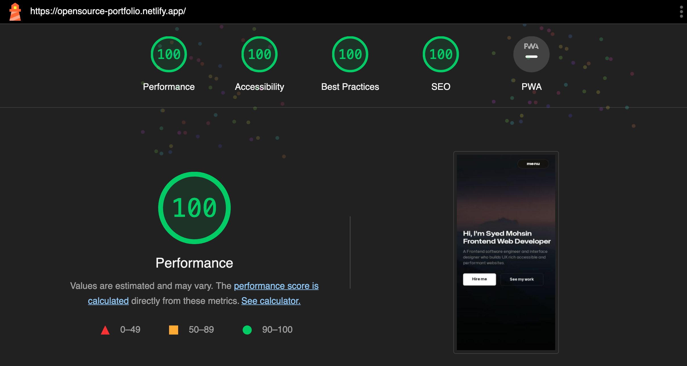

# Gonzalo Martinez Embil Portfolio

My Portfolio

[Visit site &rarr;](https://gonzaloembil.github.io/gonzaloembil.io/)

## Table of Contents

1. [My Toolkit](#my-toolkit)
1. [Projects](#projects)
1. [My Articles](#my-articles)
1. [Contact](#contact)

## My Toolkit

- Python (using libraries such us Pandas, NumPy, Scikit-learn, Matplotlib...)
- Tableau
- Power BI
- Excel
- Canva

## Projects

Please follow these three steps to make an awe-inspiring portfolio of your own.

- [Handball Data Manipulation and Visualisation with Python](#cloning-the-repository)
- [Handball Team Dashboard](#editing-the-template)
- [Handball Match Statistics Report](#deploying-the-site)
  

## My articles

If you have [Git](https://git-scm.com/) installed on your computer, you can clone or download the portfolio template by running the following command in your terminal.

## Contact

After you get the template please open it in the code editor of your choice.
