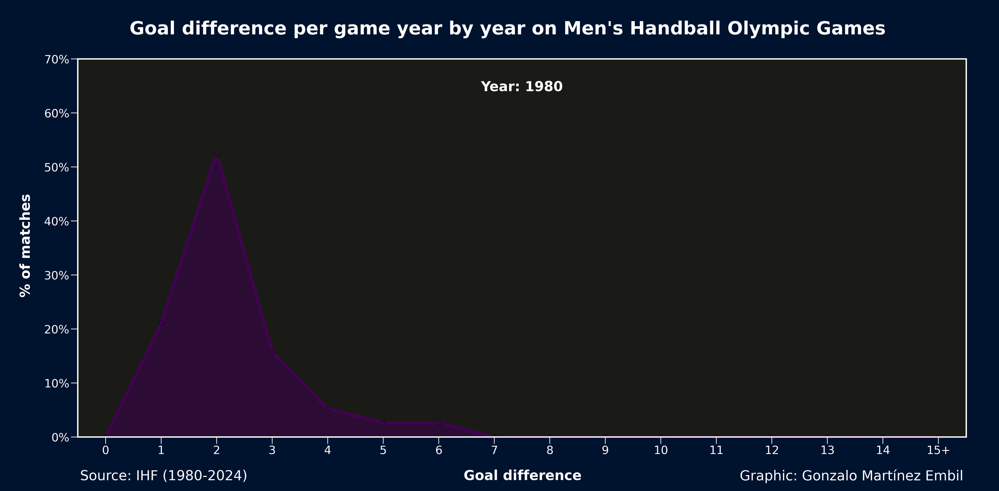

# Gonzalo Martinez Embil Portfolio

My Portfolio

[Visit site &rarr;](https://gonzaloembil.github.io/gonzaloembil.io/)

## My Toolkit

- Python (using libraries such us Pandas, NumPy, Scikit-learn, Matplotlib...)
- Tableau
- Power BI
- Excel
- Canva

## Projects

Please follow these three steps to make an awe-inspiring portfolio of your own.

- [Analysis of Inequality Evolution in Handball](https://github.com/GonzaloEmbil/Handball_Inequality_Evolution)
  
  
  
- [Analysis of the Spanish foreign sector](https://github.com/GonzaloEmbil/Spanish_Foreign_Sector)
  
  

## My articles

Coming soon...

## Contact

- [LinkedIn](https://github.com/GonzaloEmbil)

- [GitHub](https://www.linkedin.com/in/gonzalo-martínez-embil)

- [Twitter](https://x.com/GonzaloEmbil)

- Email: gonzalomembil@gmail.com
